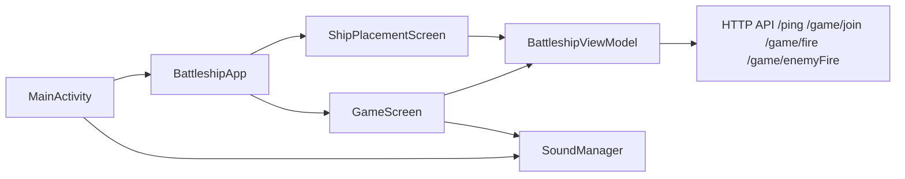
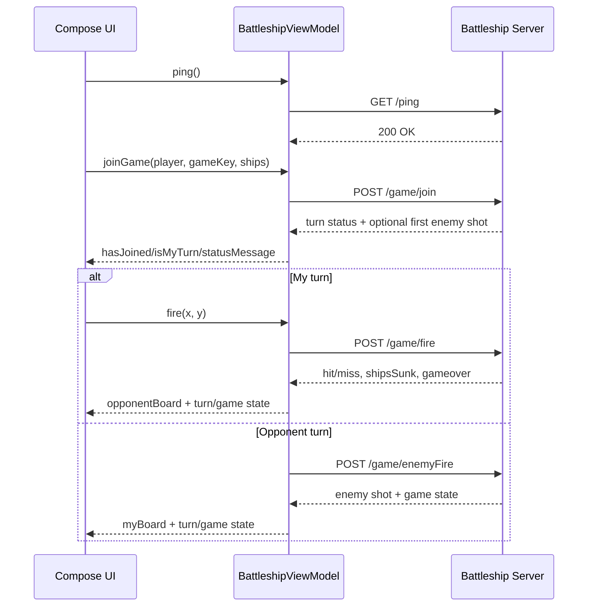

# Battleship Carrot

Author: Noor Vinnai

## Description

Battleship Carrot is an Android game client built with Kotlin and Jetpack Compose.
It is a playful carrot-themed adaptation of Battleship, made for the 26FS Mobile Applications with Android course:

- You place five "ships" on a 10x10 board (in this application you place a row of carrots, for example `Big Chungus`, `Fat Carrot`, `Lil Hop`).
- You connect to a Battleship server using a player name and a game key.
- Players take turns firing at coordinates.
- Hits and misses are shown with clear visual states on both boards.
- The match ends when all enemy ships are sunk.

The app has a custom welcome screen, themed UI elements (rabbit/carrot visuals, earthy color palette), background music, and a sound effect when firing.

Sound effects are free Sound Effects by freesound_community from Pixabay:
- Lose sound: 'Violin Win 3' Sound Effect by floraphonic from Pixabay
- 

### What it looks like

The UI has three main phases:

1. **Welcome screen** with background image and start button.
2. **Ship placement screen** where the player places all ships before joining.
3. **Game screen** with two labeled 10x10 (0-1, A-J) boards:
   - Opponent board (targeting)
   - My board (defense)

## Design

This section explains the most important implementation ideas without requiring a deep code read.

### High-level architecture

The project follows a lightweight MVVM-style structure with Compose UI:

- `MainActivity` creates `BattleshipViewModel` and `SoundManager`, then renders `BattleshipApp`.
- `BattleshipApp` chooses the active screen and wires UI actions to ViewModel methods.
- `BattleshipViewModel` contains game state, ship placement logic, and all network calls.
- `view/*` composables render board cells and user interactions from ViewModel state.
- `SoundManager` owns audio lifecycle (background music + dig sound effect).



### Code structure

Important files and responsibilities:

- `app/src/main/java/ch/fhnw/vinnai/battleshipclient/MainActivity.kt`
  - App entry point.
  - Holds default `BASE_URL` for the server.
  - Connects Android lifecycle (`onStart`, `onStop`, `onDestroy`) to audio lifecycle.

- `app/src/main/java/ch/fhnw/vinnai/battleshipclient/BattleshipApp.kt`
  - Root composable.
  - Shows Welcome -> Placement -> Game flow.
  - Provides server bar, join bar, and ping status.

- `app/src/main/java/ch/fhnw/vinnai/battleshipclient/BattleshipViewModel.kt`
  - Stores gameplay state (`myBoard`, `opponentBoard`, turns, game over, join state).
  - Implements placement rules (bounds check, overlap check, undo/reset).
  - Performs network requests via `HttpURLConnection` and JSON.
  - Converts server responses into UI state updates.

- `app/src/main/java/ch/fhnw/vinnai/battleshipclient/view/ShipPlacementScreen.kt`
  - Placement workflow UI and controls (orientation, undo, reset).

- `app/src/main/java/ch/fhnw/vinnai/battleshipclient/view/GameScreen.kt`
  - In-game boards, turn status, and game-over banner.

- `app/src/main/java/ch/fhnw/vinnai/battleshipclient/view/GridCell.kt`
  - Board cell renderer for EMPTY/SHIP/HIT/MISS states.

- `app/src/main/java/ch/fhnw/vinnai/battleshipclient/SoundManager.kt`
  - Plays `res/raw/garden.mp3` loop and `res/raw/dig.ogg` effect.

### Data model and board logic

The board is represented as two 10x10 matrices:

- `myBoard`: defense board showing own ships and enemy shots.
- `opponentBoard`: targeting board showing player shots.

Each cell has `CellState`:

- `EMPTY`
- `SHIP`
- `HIT`
- `MISS`

Ship placement is sequential using `ShipType.entries`. The player places one ship at a time. For each placement attempt, the ViewModel validates:

1. The ship fits inside board bounds.
2. The ship does not overlap existing ships.

If valid, occupied cells become `SHIP`; otherwise an error message is shown in the placement UI.

### Game and networking flow

The app communicates with an external server using these endpoints:

- `GET /ping`
- `POST /game/join`
- `POST /game/fire`
- `POST /game/enemyFire`

The flow is designed around turn ownership:

1. Player pings server.
2. Player joins with name, game key, and placed ships.
3. If it is your turn, you fire (`/game/fire`).
4. If not your turn, the client waits for enemy action (`/game/enemyFire`).
5. Loop until `gameover` is true.



### Key implementation ideas

- **Reactive state with Compose:** UI automatically redraws when mutable state in the ViewModel changes.
- **Single source of truth:** game state is centralized in `BattleshipViewModel` to keep screen composables simple.
- **Separation of concerns:** UI files render and forward actions; ViewModel handles rules + HTTP + JSON.
- **Turn-safe actions:** firing is guarded by checks (`isMyTurn`, `gameOver`, and empty target cell).
- **Simple protocol mapping:** JSON responses are parsed immediately and mapped to board/turn updates.

## Usage

### Prerequisites

- Windows/macOS/Linux with Android Studio installed.
- Android SDK for API 36 (target SDK) and min SDK 27 compatibility.
- Android emulator or physical Android device.
- A running Battleship backend server that supports the endpoints listed above.

### Configure server endpoint

Update `BASE_URL` in `app/src/main/java/ch/fhnw/vinnai/battleshipclient/MainActivity.kt`.

Current value in code:

```kotlin
const val BASE_URL = "http://192.168.1.76:50003"
```

Notes:
- For Android Emulator to local machine, common value is `http://10.0.2.2:<port>`.
- `android:usesCleartextTraffic="true"` is enabled, so HTTP (non-HTTPS) is allowed.

### Run from Android Studio

1. Open project folder in Android Studio.
2. Let Gradle sync complete.
3. Choose an emulator/device.
4. Run the `app` configuration.

### Gameplay steps

1. Launch app and click **Start**.
2. Place all ships on the placement board.
3. Press **Ping** to verify server connectivity.
4. Enter user name and game key.
5. Press **Join Game**.
6. Play turns until one player wins.

### Fresh-computer validation checklist

To satisfy delivery quality, verify on a machine that has not been used for development of this project.

Checklist:

- [ ] Clone repository on a fresh computer.
- [ ] Install required SDK/tooling only from documented steps.
- [ ] Sync Gradle successfully (no hidden local dependency hacks).
- [ ] Launch app on emulator/device.
- [ ] Confirm audio works (background and dig effect).
- [ ] Confirm ship placement rules (bounds + overlap) behave correctly.
- [ ] Confirm two clients can join the same game key and finish a full match.
- [ ] Confirm no crashes during join, fire, wait, and game-over transitions.

Recommended evidence to keep with your submission:

- Android Studio run screenshot on fresh machine.
- Short test notes (device/emulator, OS, date, result).
- Any setup issues encountered and how they were resolved.


